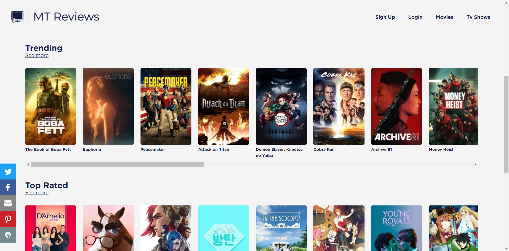
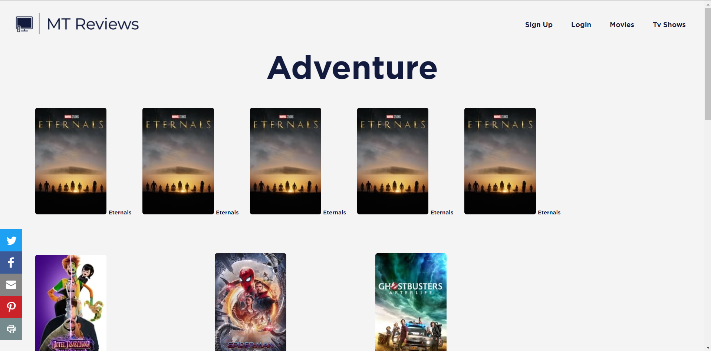

# MT Reviews
[MTReviews](https://github.com/hudds-awp2021-cht2520/assignment-01-johnmaf21/tree/master) 
is a laravel web application where you can review, comment and react to movies and tv shows which you have watched.You can add/remove movies and tv shows to your watchlist and indicate what shows and tv shows they have completed.

In this project I attempted to implement an **EAV model** however due to issues the package this had to be abandoned. The issue can be found in the following link. https://github.com/rinvex/laravel-attributes/issues/164
## Installation

#### Install php
- Firstly install php 8 PHP 8 x64 Thread Safe ZIP package from https://www.php.net/downloads.php

- Create a new <code>php</code> folder in the root of your <code>C:\ </code> and extract the contents of the zip into that folder

- Configure <code>php.ini</code> by removing the leading <code>;</code> from the needed extensions. For example: <code>;extension=mysql</code> to <code>extension=mysql</code>

- Add <code>C:\php</code> to the path environment variable by clicking the Windows Start button and type “environment”, then click **Edit the system environment variables**. Select the **Advanced** tab, and click the **Environment Variables** button.

- Scroll down the **System variables** list and click **Path** followed by the **Edit** button. Click **New** and add <code>C:\php</code>:


#### Install xampp
- Go to https://sourceforge.net/projects/xampp/files/XAMPP%20Windows/8.0.10/ and download the file <code>
  xampp-portable-windows-x64-8.0.10-0-VS16.zip</code>

- Create a new <code>xampp</code> folder in the root of your <code>C:\ </code> and extract the contents of the zip into that folder


#### Install composer
- Navigate to xampp in git-bash terminal
```bash
cd C:\xampp
```

- Either through git-bash terminal or <code>xampp-control.exe</code> shell terminal, run the commands below to run composer 
```bash
php -r "copy('https://getcomposer.org/installer', 'composer-setup.php');"
php -r "if (hash_file('sha384', 'composer-setup.php') === '906a84df04cea2aa72f40b5f787e49f22d4c2f19492ac310e8cba5b96ac8b64115ac402c8cd292b8a03482574915d1a8') { echo 'Installer verified'; } else { echo 'Installer corrupt'; unlink('composer-setup.php'); } echo PHP_EOL;"
php composer-setup.php
php -r "unlink('composer-setup.php');"
```

#### Install node
 - Go to https://nodejs.org/de/blog/release/v14.16.0/ and choose <code>Windows 64-bit Installer</code>

 - Follow the installer instructions to install node. Make sure a **PATH environment variable** is created

#### Install MT Reviews
- Navigate to <code>C:\xampp</code> in git-bash
```bash
cd C:\xampp\
```

- Go to MT Reviews repo (https://github.com/hudds-awp2021-cht2520/assignment-02-johnmaf21) and under clone click ssh and copy the address.
```bash
git@github.com:hudds-awp2021-cht2520/assignment-02-johnmaf21.git
```
- Create a new ssh key by using the command below and press enter 3 times to save default settings
```bash
ssh-keygen -o
```
- Run the command below to get the ssh public key
```bash
cat ~/.ssh/id_rsa.pub
```
- Copy the ssh public key and paste the SSH key in the new key <code>SSH and GPG keys</code> section of your github account
- Finally run the command below
```bash
ssh git@github.com
```
- Navigate to <code>C:\xampp\htdocs\ </code> and run the commands below in git-bash terminal to clone repository
```bash
 cd C:\xampp\htdocs
 mkdir assignment02
 cd assignment02
 git clone git@github.com:hudds-awp2021-cht2520/assignment-02-johnmaf21.git
```
- Configure the webserver to ensure that it point to <code>assignment02/public/</code>
- Click start for **apache** and **mysql** then click admin for **mysql**. Once **phpmyadmin** has loaded create a new DB in MySQL. Make sure to kept a note of the database name, username and password as this will be needed for the .env file
- Install Guzzle/Http in terminal whilst in <code>assignment02</code> directory
```bash
  ../../composer.phar require guzzlehttp/guzzle
```  
- Install Laravel Fortify in terminal whilst in <code>assignment02</code> directory
```bash
  ../../composer.phar require laravel/fortify
```  
- Install Laravel Socialite in terminal whilst in <code>assignment02</code> directory
```bash
  ../../composer.phar require laravel/socialite
``` 
- Generate key
```bash
  php artisan key:generate
``` 
- Migrate the tables
```bash
  php artisan migrate
``` 
- Seed the tables. MT Reviews can be used without this step but if you want pre-made data run this command
```bash
  php artisan db:seed
``` 
- Copy the contents of <code>.env.example</code> into <code>.env</code>
- Edit .env with the details for your table
```bash
    DB_CONNECTION=mysql
    DB_HOST=127.0.0.1
    DB_PORT=3306
    DB_DATABASE=databaseName
    DB_USERNAME=databaseUsername
    DB_PASSWORD=databasePassword
```


## Usage
Make sure start is turned on in **xampp-control.exe** for **Apache** and **MySQL**

Once you have finished the installation go to https://localhost to view the page

#### Welcome Page
This is the first page the user would see. It allows a user to browse through the movies and tv shows as a guest or login/sign in


#### Login Page
The login page can be accessed in multiple places and once the user is logged in they are redirected to the previous page they were on unless they were on the welcome page which in that case they will be taken to the intro page

The user can either login from email or from their google account (their was an error with twitter and github)

The User can also request to reset their password if they have forgotten it

Once they have entered the email of the account that they want ot reset the password for they will be sent an email which will then take them to a page to reset their password. This change will be reflected in the database


#### Register Page
A user is also able to register a new account which is usable. Once registered the user doesn't have to do two factor authentication te first time but they will be prompted to verify their email for the next time they sign in.


Once the user clicks on verify email button an email will be sent to the user with a link which will verify their email and update the change in the database


#### Intro Page
Redirect user to either movies or tvshows page
 


#### Movies/TV Shows Page
As mentioned before the user can access these pages with or without an account. With an account the can add movies and tv shows to their watchlist and see which ones have been completed




There is still some css needed for watchlist div

#### See All Page
If a user wants to see more of a certain topic then they can. At the moment there is only one page and it still needs more css. However, the code is in the controller to call more movies/tvshows from the api for the specific topic to display on the numbered page


#### Specific Movies Page
Currently there is no specific page for tv shows and episodes however they would be very similar to the movies page. Again the user can access this page with or without an account however, they will be missing functionality if they are not signed in. So they will be prompted to sign in


There is also link to the movie's official social media

The user can share the page they are currently on at any time


When the user is signed in they can add the movie to their watchlist. The add button is to the left so it still needs som css


If the user is signed in then the can also add their own comment for a specific movie


#### TMDB API
TMDB API is the api being used to get all of the media data which meant i was able to remove a few more tables to make it more manageable. The TMDB_API key can be found in <code>.env</code> file in case it needs to be changed
https://www.themoviedb.org/signup

## Testing
To run the tests in git-bash navigate to <code>C:\xampp\htdocs\assignment02</code> and run the command
```bash
  php artisan test
``` 

Current there is testing for:
- Register
- Login
- Reset Password
- Email verification

## Two-Factor Authentication Feature
One feature which was added to MT Reviews for the second part of the assignment was two-factor authentication. This was added to provide extra security for logged in users as the user will need to full access to their email credentials as well as the credentials for MT review web application. This means it is much likely the person signing in is the actual owner/creator of the account that they are trying to sign into. This is also a good method as it stops people using fake or inactive emails when logging into MT Reviews which could be extremely useful in the future is I need to send advertising or important information about their account in the future.

The way that this works is the user first needs to sign in with the email and password for the given account the want to sign in.


As soon as the click login validation is performed with the credential information to ensure that the account exists; the right password for that account has been provided and it doesn’t correspond to an account with a different auth_type like google or twitter as they have their own two factor authentication system, if set up, so I’m trying to make sure the user doesn’t have to perform it twice.
```php
if (Auth::attempt($credentials,$request->rememberMe)) {

            Auth::user()->generateTwoFactorCode();
            Auth::user()->notify(new TwoFactorCode());

            return view('auth/two-factor-challenge');
        }
```
Once authenticated a random two factor code is generated for the specific user 
```php
public function generateTwoFactorCode()
    {
        $this->timestamps = false;

        $this->two_factor_code = rand(100000, 999999);
        $this->two_factor_expires_at = now()->addMinutes(10);
        $this->save();
    }
```
and that code is sent to the user as an email.
```php
class TwoFactorCode extends Notification
{
    use Queueable;

    public function via($notifiable) {
        return ['mail'];
    }

    public function toMail($notifiable)
    {
        return (new MailMessage)
            ->line('Your two factor code is '.$notifiable->two_factor_code)
            ->action('Verify Here', route('showTwoFactor'))
            ->line('The code will expire in 10 minutes')
            ->line('If you have not tried to login, ignore this message.');
    }

}
```
Once the email is sent the page is then redirected to the two-factor-challenge page where they can enter the code that is provided in the email and then click verify to ensure that the code entered matches the code entered by the user matches the code generated for the user. The two-factor-challenge page can also be accessed via the link in the email.


If the user doesn’t enter the code with the first 10 minutes or the may have not received the code even when the email is active then the click resend to generate a new code for the given user and have that code sent to their email again.
I chose to use a code which is sent to their email instead of a QR code as it provides more assurance that the email used is real and there may be some cases when the user may not have their phone with them which may cause an issue when they are trying to sign in 


